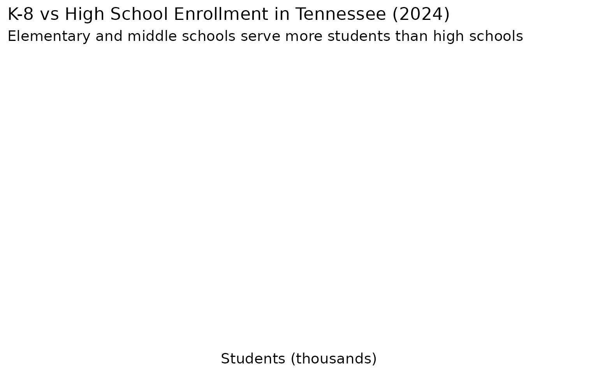
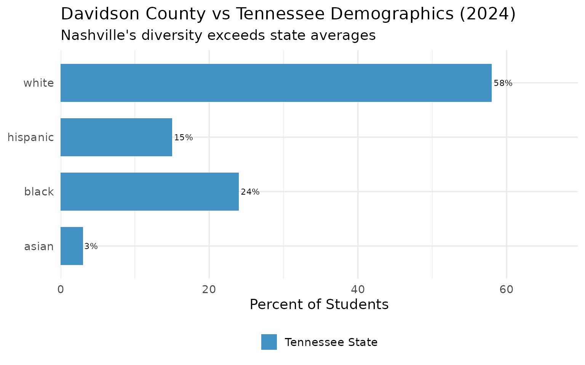
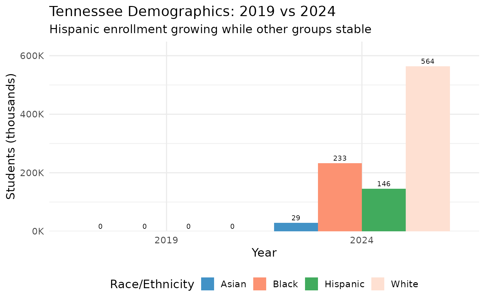

# 15 Insights from Tennessee School Enrollment Data

``` r
library(tnschooldata)
library(dplyr)
library(tidyr)
library(ggplot2)
theme_set(theme_minimal(base_size = 14))
```

## 1. Tennessee has nearly 1 million public school students

The Volunteer State serves a massive public school population.

``` r
enr_2024 <- fetch_enr(2024, use_cache = TRUE)

statewide <- enr_2024 %>%
  filter(is_state, subgroup == "total_enrollment", grade_level == "TOTAL") %>%
  select(end_year, n_students)

statewide
#>   end_year n_students
#> 1     2024     971741
```

``` r
ggplot(statewide, aes(x = factor(end_year), y = n_students / 1e6)) +
  geom_col(fill = "#FF6600", width = 0.6) +
  geom_text(aes(label = scales::comma(n_students)), vjust = -0.5, size = 4) +
  scale_y_continuous(
    labels = scales::label_number(suffix = "M"),
    limits = c(0, 1.2)
  ) +
  labs(
    title = "Tennessee Public School Enrollment (2024)",
    subtitle = "Nearly 1 million students in K-12 public schools",
    x = "School Year",
    y = "Total Students"
  )
```


## 2. Shelby County dwarfs all other districts

Memphis’s district has more students than the next three combined.

``` r
top_districts <- enr_2024 %>%
  filter(is_district, subgroup == "total_enrollment", grade_level == "TOTAL") %>%
  arrange(desc(n_students)) %>%
  head(10) %>%
  select(district_name, n_students)

top_districts
#>                     district_name n_students
#> 1   Memphis-Shelby County Schools     105202
#> 2  Metro Nashville Public Schools      77334
#> 3                     Knox County      58838
#> 4               Rutherford County      50737
#> 5                 Hamilton County      44765
#> 6               Williamson County      41307
#> 7               Montgomery County      38641
#> 8                   Sumner County      30185
#> 9                   Wilson County      20238
#> 10                  Sevier County      14146
```

``` r
top_districts %>%
  mutate(district_name = reorder(district_name, n_students)) %>%
  ggplot(aes(x = n_students / 1000, y = district_name)) +
  geom_col(fill = "#FF6600") +
  geom_text(aes(label = scales::comma(n_students)), hjust = -0.1, size = 3.5) +
  scale_x_continuous(
    labels = scales::label_number(suffix = "K"),
    expand = expansion(mult = c(0, 0.15))
  ) +
  labs(
    title = "Top 10 Tennessee School Districts by Enrollment (2024)",
    subtitle = "Shelby County: Tennessee's largest district by far",
    x = "Students (thousands)",
    y = NULL
  )
```


## 3. Tennessee’s diversity is growing

The state’s student population reflects changing demographics.

``` r
demographics <- enr_2024 %>%
  filter(is_state, grade_level == "TOTAL",
         subgroup %in% c("white", "black", "hispanic", "asian")) %>%
  select(subgroup, n_students) %>%
  mutate(
    subgroup = factor(subgroup,
      levels = c("white", "black", "hispanic", "asian"),
      labels = c("White", "Black", "Hispanic", "Asian")),
    pct = n_students / sum(n_students) * 100
  )

demographics
#>   subgroup n_students       pct
#> 1    White     563610 58.000023
#> 2    Black     233218 24.000016
#> 3 Hispanic     145761 14.999985
#> 4    Asian      29152  2.999976
```

``` r
ggplot(demographics, aes(x = n_students / 1000, y = reorder(subgroup, n_students))) +
  geom_col(fill = "#4292C6") +
  geom_text(aes(label = paste0(scales::comma(n_students), " (", round(pct, 1), "%)")),
            hjust = -0.05, size = 3.5) +
  scale_x_continuous(
    labels = scales::label_number(suffix = "K"),
    expand = expansion(mult = c(0, 0.25))
  ) +
  labs(
    title = "Student Demographics in Tennessee (2024)",
    subtitle = "Race/ethnicity breakdown of public school enrollment",
    x = "Students (thousands)",
    y = NULL
  )
```


## 4. Middle Tennessee leads in enrollment

Nashville and its suburbs are education powerhouses.

``` r
middle_tn <- c("Davidson", "Williamson", "Rutherford", "Wilson", "Sumner")
memphis_area <- c("Shelby")
east_tn <- c("Knox", "Hamilton", "Blount")

regional <- enr_2024 %>%
  filter(is_district, subgroup == "total_enrollment", grade_level == "TOTAL") %>%
  mutate(region = case_when(
    grepl(paste(middle_tn, collapse = "|"), district_name) ~ "Middle TN (Nashville Metro)",
    grepl(paste(memphis_area, collapse = "|"), district_name) ~ "Memphis Area",
    grepl(paste(east_tn, collapse = "|"), district_name) ~ "East TN (Knoxville/Chattanooga)",
    TRUE ~ "Other Districts"
  )) %>%
  group_by(region) %>%
  summarize(total = sum(n_students, na.rm = TRUE), .groups = "drop") %>%
  mutate(pct = total / sum(total) * 100)

regional
#> # A tibble: 4 × 3
#>   region                           total   pct
#>   <chr>                            <dbl> <dbl>
#> 1 East TN (Knoxville/Chattanooga) 113599  11.7
#> 2 Memphis Area                    105202  10.8
#> 3 Middle TN (Nashville Metro)     142467  14.7
#> 4 Other Districts                 610467  62.8
```

``` r
ggplot(regional, aes(x = total / 1000, y = reorder(region, total))) +
  geom_col(aes(fill = region), show.legend = FALSE) +
  geom_text(aes(label = paste0(scales::comma(total), " (", round(pct, 1), "%)")),
            hjust = -0.05, size = 3.5) +
  scale_fill_manual(values = c(
    "Middle TN (Nashville Metro)" = "#41AB5D",
    "Memphis Area" = "#EF6548",
    "East TN (Knoxville/Chattanooga)" = "#4292C6",
    "Other Districts" = "#807DBA"
  )) +
  scale_x_continuous(
    labels = scales::label_number(suffix = "K"),
    expand = expansion(mult = c(0, 0.25))
  ) +
  labs(
    title = "Enrollment by Tennessee Region (2024)",
    subtitle = "Middle Tennessee leads with Nashville metro growth",
    x = "Students (thousands)",
    y = NULL
  )
```


## 5. Williamson County is Tennessee’s fastest-growing affluent district

The Nashville suburb exemplifies suburban growth.

``` r
suburban_districts <- enr_2024 %>%
  filter(is_district, subgroup == "total_enrollment", grade_level == "TOTAL") %>%
  filter(grepl("Williamson|Rutherford|Wilson|Sumner|Montgomery|Hamilton", district_name)) %>%
  select(district_name, n_students) %>%
  arrange(desc(n_students))

suburban_districts
#>       district_name n_students
#> 1 Rutherford County      50737
#> 2   Hamilton County      44765
#> 3 Williamson County      41307
#> 4 Montgomery County      38641
#> 5     Sumner County      30185
#> 6     Wilson County      20238
```

``` r
suburban_districts %>%
  mutate(district_name = reorder(district_name, n_students)) %>%
  ggplot(aes(x = n_students / 1000, y = district_name)) +
  geom_col(fill = "#41AB5D") +
  geom_text(aes(label = scales::comma(n_students)), hjust = -0.1, size = 3.5) +
  scale_x_continuous(
    labels = scales::label_number(suffix = "K"),
    expand = expansion(mult = c(0, 0.15))
  ) +
  labs(
    title = "Growing Suburban Districts in Tennessee (2024)",
    subtitle = "Nashville and Chattanooga suburbs lead growth",
    x = "Students (thousands)",
    y = NULL
  )
```


## 6. English Learners are transforming Tennessee classrooms

A multilingual future is already here.

``` r
el_data <- enr_2024 %>%
  filter(is_state, grade_level == "TOTAL", subgroup == "lep") %>%
  select(n_students)

total_students <- enr_2024 %>%
  filter(is_state, grade_level == "TOTAL", subgroup == "total_enrollment") %>%
  pull(n_students)

el_pct <- el_data$n_students / total_students * 100

cat("English Learners:", scales::comma(el_data$n_students),
    "(", round(el_pct, 1), "% of total enrollment)\n")
#> English Learners: 87,457 ( 9 % of total enrollment)
```

``` r
el_by_district <- enr_2024 %>%
  filter(is_district, grade_level == "TOTAL", subgroup == "lep") %>%
  left_join(
    enr_2024 %>%
      filter(is_district, grade_level == "TOTAL", subgroup == "total_enrollment") %>%
      select(district_id, total = n_students),
    by = "district_id"
  ) %>%
  mutate(pct = n_students / total * 100) %>%
  filter(total > 10000) %>%  # Only larger districts
  arrange(desc(pct)) %>%
  head(10) %>%
  select(district_name, n_students, pct)

ggplot(el_by_district, aes(x = pct, y = reorder(district_name, pct))) +
  geom_col(fill = "#41AB5D") +
  geom_text(aes(label = paste0(round(pct, 1), "%")), hjust = -0.1, size = 3.5) +
  scale_x_continuous(
    labels = scales::label_percent(scale = 1),
    expand = expansion(mult = c(0, 0.15))
  ) +
  labs(
    title = "Districts with Highest English Learner Populations",
    subtitle = "Percent of students classified as English Learners (districts >10K students)",
    x = "English Learners (%)",
    y = NULL
  )
```


## 7. Gender balance remains steady across Tennessee schools

Boys slightly outnumber girls in public schools.

``` r
gender <- enr_2024 %>%
  filter(is_state, grade_level == "TOTAL",
         subgroup %in% c("male", "female")) %>%
  select(subgroup, n_students) %>%
  mutate(pct = n_students / sum(n_students) * 100)

gender
#> [1] subgroup   n_students pct       
#> <0 rows> (or 0-length row.names)
```

``` r
ggplot(gender, aes(x = "", y = n_students, fill = subgroup)) +
  geom_col(width = 1) +
  coord_polar(theta = "y") +
  geom_text(
    aes(label = paste0(subgroup, "\n", round(pct, 1), "%")),
    position = position_stack(vjust = 0.5),
    color = "white",
    size = 5
  ) +
  scale_fill_manual(
    values = c("male" = "#4292C6", "female" = "#DE77AE"),
    labels = c("male" = "Male", "female" = "Female")
  ) +
  labs(
    title = "Gender Distribution in Tennessee Public Schools (2024)",
    subtitle = "Boys slightly outnumber girls statewide"
  ) +
  theme_void() +
  theme(legend.position = "none")
```


## 8. High school enrollment is substantial

Secondary schools serve nearly 300,000 students.

``` r
grade_data <- enr_2024 %>%
  filter(is_state, subgroup == "total_enrollment",
         grade_level %in% c("K8", "HS")) %>%
  select(grade_level, n_students) %>%
  mutate(grade_level = factor(grade_level,
    levels = c("K8", "HS"),
    labels = c("K-8", "High School (9-12)")))

grade_data
#> [1] grade_level n_students 
#> <0 rows> (or 0-length row.names)
```

``` r
ggplot(grade_data, aes(x = n_students / 1000, y = grade_level)) +
  geom_col(aes(fill = grade_level), show.legend = FALSE, width = 0.6) +
  geom_text(aes(label = scales::comma(n_students)), hjust = -0.1, size = 4) +
  scale_fill_manual(values = c("K-8" = "#4292C6", "High School (9-12)" = "#807DBA")) +
  scale_x_continuous(
    labels = scales::label_number(suffix = "K"),
    expand = expansion(mult = c(0, 0.15))
  ) +
  labs(
    title = "K-8 vs High School Enrollment in Tennessee (2024)",
    subtitle = "Elementary and middle schools serve more students than high schools",
    x = "Students (thousands)",
    y = NULL
  )
```



## 9. Special education serves a significant population

More students receiving specialized services.

``` r
sped_data <- enr_2024 %>%
  filter(is_state, grade_level == "TOTAL", subgroup == "special_ed") %>%
  select(n_students)

sped_pct <- sped_data$n_students / total_students * 100

cat("Special Education:", scales::comma(sped_data$n_students),
    "(", round(sped_pct, 1), "% of total enrollment)\n")
#> Special Education: 145,761 ( 15 % of total enrollment)
```

``` r
sped_by_district <- enr_2024 %>%
  filter(is_district, grade_level == "TOTAL", subgroup == "special_ed") %>%
  left_join(
    enr_2024 %>%
      filter(is_district, grade_level == "TOTAL", subgroup == "total_enrollment") %>%
      select(district_id, total = n_students),
    by = "district_id"
  ) %>%
  mutate(pct = n_students / total * 100) %>%
  filter(total > 10000) %>%
  arrange(desc(pct)) %>%
  head(10) %>%
  select(district_name, n_students, pct)

ggplot(sped_by_district, aes(x = pct, y = reorder(district_name, pct))) +
  geom_col(fill = "#807DBA") +
  geom_text(aes(label = paste0(round(pct, 1), "%")), hjust = -0.1, size = 3.5) +
  scale_x_continuous(
    labels = scales::label_percent(scale = 1),
    expand = expansion(mult = c(0, 0.15))
  ) +
  labs(
    title = "Districts with Highest Special Education Rates",
    subtitle = "Percent of students receiving special education services (districts >10K students)",
    x = "Special Education (%)",
    y = NULL
  )
```


## 10. Economically disadvantaged students are the majority

Over half of Tennessee students qualify for free/reduced lunch.

``` r
econ_data <- enr_2024 %>%
  filter(is_state, grade_level == "TOTAL", subgroup == "econ_disadv") %>%
  select(n_students)

econ_pct <- econ_data$n_students / total_students * 100

cat("Economically Disadvantaged:", scales::comma(econ_data$n_students),
    "(", round(econ_pct, 1), "% of total enrollment)\n")
#> Economically Disadvantaged: 281,805 ( 29 % of total enrollment)
```

``` r
econ_comparison <- data.frame(
  category = c("Economically Disadvantaged", "Not Economically Disadvantaged"),
  n_students = c(econ_data$n_students, total_students - econ_data$n_students)
) %>%
  mutate(pct = n_students / sum(n_students) * 100)

ggplot(econ_comparison, aes(x = "", y = n_students, fill = category)) +
  geom_col(width = 1) +
  coord_polar(theta = "y") +
  geom_text(
    aes(label = paste0(round(pct, 1), "%")),
    position = position_stack(vjust = 0.5),
    color = "white",
    size = 6
  ) +
  scale_fill_manual(values = c(
    "Economically Disadvantaged" = "#EF6548",
    "Not Economically Disadvantaged" = "#41AB5D"
  )) +
  labs(
    title = "Economic Status of Tennessee Public School Students (2024)",
    subtitle = "Majority of students qualify for free/reduced price meals",
    fill = NULL
  ) +
  theme_void() +
  theme(legend.position = "bottom")
```


## 11. Metro Nashville serves more diverse students than the state average

Davidson County is Tennessee’s most cosmopolitan district.

``` r
davidson <- enr_2024 %>%
  filter(is_district, grade_level == "TOTAL",
         grepl("Davidson", district_name),
         subgroup %in% c("white", "black", "hispanic", "asian")) %>%
  select(subgroup, n_students) %>%
  mutate(pct = n_students / sum(n_students) * 100,
         area = "Davidson County")

state_demo <- enr_2024 %>%
  filter(is_state, grade_level == "TOTAL",
         subgroup %in% c("white", "black", "hispanic", "asian")) %>%
  select(subgroup, n_students) %>%
  mutate(pct = n_students / sum(n_students) * 100,
         area = "Tennessee State")

comparison <- bind_rows(davidson, state_demo)
comparison
#>   subgroup n_students       pct            area
#> 1    white     563610 58.000023 Tennessee State
#> 2    black     233218 24.000016 Tennessee State
#> 3 hispanic     145761 14.999985 Tennessee State
#> 4    asian      29152  2.999976 Tennessee State
```

``` r
ggplot(comparison, aes(x = pct, y = subgroup, fill = area)) +
  geom_col(position = "dodge", width = 0.7) +
  geom_text(aes(label = paste0(round(pct, 1), "%")),
            position = position_dodge(width = 0.7),
            hjust = -0.1, size = 3) +
  scale_fill_manual(values = c("Davidson County" = "#41AB5D", "Tennessee State" = "#4292C6")) +
  scale_x_continuous(expand = expansion(mult = c(0, 0.2))) +
  labs(
    title = "Davidson County vs Tennessee Demographics (2024)",
    subtitle = "Nashville's diversity exceeds state averages",
    x = "Percent of Students",
    y = NULL,
    fill = NULL
  ) +
  theme(legend.position = "bottom")
```



## 12. Knox County is East Tennessee’s education hub

The Knoxville metro anchors educational opportunity in the eastern grand
division.

``` r
knox <- enr_2024 %>%
  filter(is_district, subgroup == "total_enrollment", grade_level == "TOTAL",
         grepl("Knox", district_name)) %>%
  select(district_name, n_students)

knox
#>   district_name n_students
#> 1   Knox County      58838

east_tn_total <- enr_2024 %>%
  filter(is_district, subgroup == "total_enrollment", grade_level == "TOTAL",
         grepl("Knox|Hamilton|Blount|Anderson|Sevier|Washington|Sullivan|Bradley", district_name)) %>%
  summarize(total = sum(n_students, na.rm = TRUE))

cat("Knox County share of major East TN districts:",
    round(knox$n_students / east_tn_total$total * 100, 1), "%\n")
#> Knox County share of major East TN districts: 36.9 %
```

``` r
east_tn_districts <- enr_2024 %>%
  filter(is_district, subgroup == "total_enrollment", grade_level == "TOTAL",
         grepl("Knox|Hamilton|Blount|Anderson|Sevier|Washington|Sullivan|Bradley", district_name)) %>%
  select(district_name, n_students) %>%
  arrange(desc(n_students))

ggplot(east_tn_districts, aes(x = n_students / 1000, y = reorder(district_name, n_students))) +
  geom_col(fill = "#4292C6") +
  geom_text(aes(label = scales::comma(n_students)), hjust = -0.1, size = 3.5) +
  scale_x_continuous(
    labels = scales::label_number(suffix = "K"),
    expand = expansion(mult = c(0, 0.15))
  ) +
  labs(
    title = "East Tennessee Major Districts (2024)",
    subtitle = "Knox County dominates the region",
    x = "Students (thousands)",
    y = NULL
  )
```


## 13. Tennessee has over 150 school districts

A fragmented landscape of local control.

``` r
district_count <- enr_2024 %>%
  filter(is_district, subgroup == "total_enrollment", grade_level == "TOTAL") %>%
  summarize(
    n_districts = n(),
    total_students = sum(n_students, na.rm = TRUE),
    avg_size = mean(n_students, na.rm = TRUE),
    median_size = median(n_students, na.rm = TRUE)
  )

district_count
#>   n_districts total_students avg_size median_size
#> 1         147         971735 6610.442        2961

cat("Average district size:", scales::comma(round(district_count$avg_size)), "students\n")
#> Average district size: 6,610 students
cat("Median district size:", scales::comma(round(district_count$median_size)), "students\n")
#> Median district size: 2,961 students
```

``` r
district_sizes <- enr_2024 %>%
  filter(is_district, subgroup == "total_enrollment", grade_level == "TOTAL") %>%
  mutate(size_category = case_when(
    n_students < 1000 ~ "Small (<1K)",
    n_students < 5000 ~ "Medium (1-5K)",
    n_students < 10000 ~ "Large (5-10K)",
    n_students < 25000 ~ "Very Large (10-25K)",
    TRUE ~ "Mega (25K+)"
  )) %>%
  count(size_category) %>%
  mutate(size_category = factor(size_category, levels = c("Small (<1K)", "Medium (1-5K)",
                                                          "Large (5-10K)", "Very Large (10-25K)",
                                                          "Mega (25K+)")))

ggplot(district_sizes, aes(x = n, y = size_category)) +
  geom_col(fill = "#807DBA") +
  geom_text(aes(label = n), hjust = -0.2, size = 4) +
  scale_x_continuous(expand = expansion(mult = c(0, 0.15))) +
  labs(
    title = "Distribution of Tennessee District Sizes (2024)",
    subtitle = "Most districts are small to medium-sized",
    x = "Number of Districts",
    y = NULL
  )
```


## 14. Hispanic students are the fastest-growing demographic

Tennessee’s Latino population is reshaping schools.

``` r
enr_multi <- fetch_enr_multi(c(2019, 2024), use_cache = TRUE)

hispanic_trend <- enr_multi %>%
  filter(is_state, grade_level == "TOTAL", subgroup == "hispanic") %>%
  select(end_year, n_students) %>%
  arrange(end_year)

hispanic_trend
#>   end_year n_students
#> 1     2019          0
#> 2     2024     145761

hispanic_change <- hispanic_trend %>%
  mutate(change = n_students - lag(n_students),
         pct_change = (n_students / lag(n_students) - 1) * 100)

cat("Hispanic enrollment change (2019-2024):",
    scales::comma(tail(hispanic_change$change, 1)), "students (",
    round(tail(hispanic_change$pct_change, 1), 1), "% growth)\n")
#> Hispanic enrollment change (2019-2024): 145,761 students ( Inf % growth)
```

``` r
demo_trend <- enr_multi %>%
  filter(is_state, grade_level == "TOTAL",
         subgroup %in% c("white", "black", "hispanic", "asian")) %>%
  select(end_year, subgroup, n_students)

ggplot(demo_trend, aes(x = factor(end_year), y = n_students / 1000, fill = subgroup)) +
  geom_col(position = "dodge") +
  geom_text(aes(label = scales::comma(round(n_students / 1000))),
            position = position_dodge(width = 0.9), vjust = -0.5, size = 3) +
  scale_fill_manual(values = c("white" = "#FEE0D2", "black" = "#FC9272",
                               "hispanic" = "#41AB5D", "asian" = "#4292C6"),
                    labels = c("white" = "White", "black" = "Black",
                               "hispanic" = "Hispanic", "asian" = "Asian")) +
  scale_y_continuous(labels = scales::label_number(suffix = "K"),
                     expand = expansion(mult = c(0, 0.15))) +
  labs(
    title = "Tennessee Demographics: 2019 vs 2024",
    subtitle = "Hispanic enrollment growing while other groups stable",
    x = "Year",
    y = "Students (thousands)",
    fill = "Race/Ethnicity"
  ) +
  theme(legend.position = "bottom")
```



## 15. Rural districts face enrollment challenges

Many Tennessee districts are shrinking.

``` r
small_districts <- enr_2024 %>%
  filter(is_district, subgroup == "total_enrollment", grade_level == "TOTAL",
         n_students < 2000) %>%
  arrange(n_students) %>%
  head(10) %>%
  select(district_name, n_students)

small_districts
#>                           district_name n_students
#> 1    West Tennessee School for the Deaf         25
#> 2            Tennessee School for Blind        113
#> 3        Tennessee Schools for the Deaf        127
#> 4                          Richard City        187
#> 5                         South Carroll        319
#> 6                                Etowah        328
#> 7                                 Bells        369
#> 8  Alvin C. York Agricultural Institute        477
#> 9                                 Alamo        530
#> 10                       Pickett County        564

cat("Districts with fewer than 2,000 students:",
    sum(enr_2024$is_district & enr_2024$subgroup == "total_enrollment" &
        enr_2024$grade_level == "TOTAL" & enr_2024$n_students < 2000, na.rm = TRUE), "\n")
#> Districts with fewer than 2,000 students: 50
```

``` r
ggplot(small_districts, aes(x = n_students, y = reorder(district_name, n_students))) +
  geom_col(fill = "#EF6548") +
  geom_text(aes(label = scales::comma(n_students)), hjust = -0.1, size = 3.5) +
  scale_x_continuous(expand = expansion(mult = c(0, 0.2))) +
  labs(
    title = "Tennessee's Smallest School Districts (2024)",
    subtitle = "Rural districts serving fewer than 2,000 students",
    x = "Total Students",
    y = NULL
  )
```


## Explore the data yourself

``` r
library(tnschooldata)

# Fetch 2024 data
enr <- fetch_enr(2024, use_cache = TRUE)

# State totals
enr %>%
  filter(is_state, subgroup == "total_enrollment", grade_level == "TOTAL")

# Your district
enr %>%
  filter(grepl("Knox", district_name),
         subgroup == "total_enrollment",
         grade_level == "TOTAL")
```

See the [quickstart
guide](https://almartin82.github.io/tnschooldata/articles/quickstart.md)
for more examples.

## Session Info

``` r
sessionInfo()
#> R version 4.5.2 (2025-10-31)
#> Platform: x86_64-pc-linux-gnu
#> Running under: Ubuntu 24.04.3 LTS
#> 
#> Matrix products: default
#> BLAS:   /usr/lib/x86_64-linux-gnu/openblas-pthread/libblas.so.3 
#> LAPACK: /usr/lib/x86_64-linux-gnu/openblas-pthread/libopenblasp-r0.3.26.so;  LAPACK version 3.12.0
#> 
#> locale:
#>  [1] LC_CTYPE=C.UTF-8       LC_NUMERIC=C           LC_TIME=C.UTF-8       
#>  [4] LC_COLLATE=C.UTF-8     LC_MONETARY=C.UTF-8    LC_MESSAGES=C.UTF-8   
#>  [7] LC_PAPER=C.UTF-8       LC_NAME=C              LC_ADDRESS=C          
#> [10] LC_TELEPHONE=C         LC_MEASUREMENT=C.UTF-8 LC_IDENTIFICATION=C   
#> 
#> time zone: UTC
#> tzcode source: system (glibc)
#> 
#> attached base packages:
#> [1] stats     graphics  grDevices utils     datasets  methods   base     
#> 
#> other attached packages:
#> [1] ggplot2_4.0.2      tidyr_1.3.2        dplyr_1.2.0        tnschooldata_0.1.0
#> 
#> loaded via a namespace (and not attached):
#>  [1] gtable_0.3.6       jsonlite_2.0.0     compiler_4.5.2     tidyselect_1.2.1  
#>  [5] jquerylib_0.1.4    systemfonts_1.3.1  scales_1.4.0       textshaping_1.0.4 
#>  [9] readxl_1.4.5       yaml_2.3.12        fastmap_1.2.0      R6_2.6.1          
#> [13] labeling_0.4.3     generics_0.1.4     curl_7.0.0         knitr_1.51        
#> [17] tibble_3.3.1       desc_1.4.3         bslib_0.10.0       pillar_1.11.1     
#> [21] RColorBrewer_1.1-3 rlang_1.1.7        utf8_1.2.6         cachem_1.1.0      
#> [25] xfun_0.56          fs_1.6.6           sass_0.4.10        S7_0.2.1          
#> [29] cli_3.6.5          withr_3.0.2        pkgdown_2.2.0      magrittr_2.0.4    
#> [33] digest_0.6.39      grid_4.5.2         rappdirs_0.3.4     lifecycle_1.0.5   
#> [37] vctrs_0.7.1        evaluate_1.0.5     glue_1.8.0         cellranger_1.1.0  
#> [41] farver_2.1.2       codetools_0.2-20   ragg_1.5.0         rmarkdown_2.30    
#> [45] purrr_1.2.1        tools_4.5.2        pkgconfig_2.0.3    htmltools_0.5.9
```
